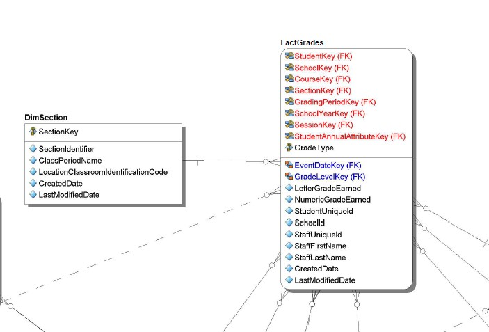

# Ed-Fi VPS Tableau Dashboards

This project is a set of Tableau dashboards created to assist with analytics and dissemination of grades, attendance, and discipline data from an Ed-Fi ODS using the 3.2 Data Standard. To preface, this Data Mart and Tableau vizualizations should be considered a prototype for what can be done with Tableau and Ed-Fi Data. The dashboards were built to address specific use cases the school district requested.

## Requirements
- Current Tableau license
- Ed-Fi ODS / API 3.1.1
- Ed-Fi Data Standard 3.2

## Installation
Stand-up your own Ed-Fi ODS and populate with data from your Student Information System via an API or Ed-Fi data loader tool. Build and connect the provided Early Warning System (EWS) datamart Model to your Ed-Fi ODS.  Connect your Tableau software to the Data Mart and create the visualizations and publish to the server of your choice.  

## Usage
The dashboard we constructed consisted of three views (constructed as other dashboards within Tableau) and could be navigated into by clicking any of the three summary metrics from the main view (shown below):

There is a toolbar style section off to the right, but the functionality of this was not properly linked between all 3 of the dashboards. This was not a necessary function, but was placed to show what the next version could incorporate for functionality.

### Grades

Clicking into the grades summary metrics will open up the full grades dashboard:

Here you'll see that same table shown in the main view, along with other slices of the data such as by staff member, demographics, and school. Data can be filtered by clicking any of the data shown, aside from the staff member list--doing so will again show more granular information in a "click-through" fashion (this Staff Member focused view is shown below):

In this drill through view, the various courses a particular staff member teaches can be seen in the upper table, along with the percentage of whatever particular grade filter is chosen (in this case Letter Grade B). A total distribution of their grades across all courses will be shown across the top, and clicking on a particular section will filter the view. This view is useful to compare a staff member's course grades to other staff members who teach the same course. By first clicking on a particular course in the first table, the second list below will show all other staff members who teach the same course, making it easy to compare across a district.

### Discipline

Clicking into the discipline summary metrics will open up the full discipline dashboard:

This particular dashboard will need to be overhauled for dynamic data from the ODS. As it stands, flat file data was used to assist with visualizing the potential. Like the grades dashboard, there is click-through functionality when attempting to drill deeper into the student level.

### Attendence

Clicking into the attendance summary metrics will open up the full attendence dashboard:

Like the others, there is filtering and drill through capability simply by clicking in a particular area.  The Headwinds and Tailwinds categories in the right-hand column refer to the Academic Support Index - http://academicsupportindex.blogspot.com/2017/01/part-one-introduction-to-academic.html.

